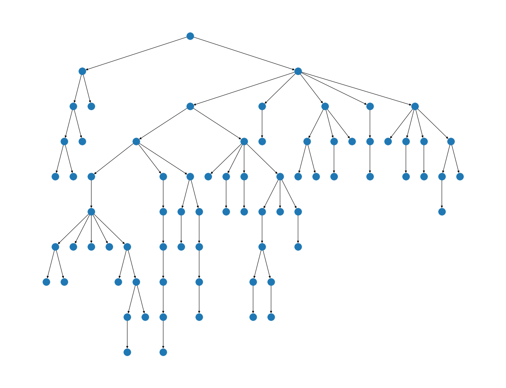

# Layered Tree Draw

Layered tree visualization algorithm. Source code available at `LayeredTreeDraw.ipynb` ([open in Google Colab](https://colab.research.google.com/github/Binpord/mipt_visualisation/blob/main/hw1_tree_visualization/LayeredTreeDraw.ipynb)).

Notebook displays example graph. GraphML xml file for this graph is also available. Reference visualization:

My method produces:

