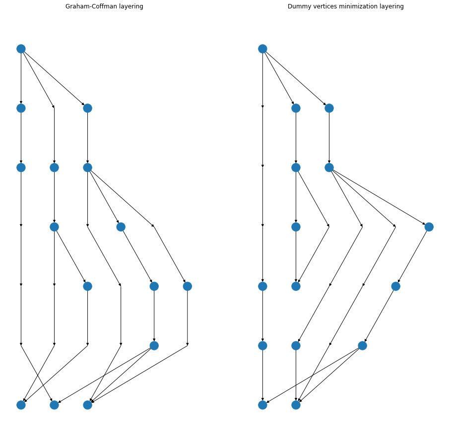
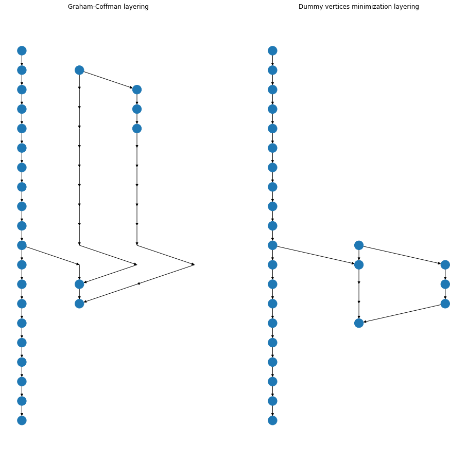

# Directed Acyclic Graph (DAG) visualization

Implements 2 DAG visualization algorithms: Coffman-Graham layering and dummy vertices minimization algorithm. Former allows to minimize graph height given constraint on maximal amount of nodes on one layer. Latter allows to minimize amount of "dummy vertices". Dummy vertex is fictional node, which is being added every time edge crosses layer without stopping. After the layering procedure graph is also goes through a crossings reducing. Crossings reduction consists of initial approximation using Median Method followed by several layer-by-layer sweeps of local search procedure.

Usage is available at `dag_visualization.ipynb` ([open in Google Colab](https://colab.research.google.com/github/Binpord/mipt_visualisation/blob/main/hw2_dag_visualization/dag_visualization.ipynb)).

Results of my method:

