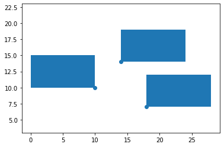

# Label placement

[Automatic label placement algorithm, based on 2-satisfiability](https://en.wikipedia.org/wiki/Automatic_label_placement#2-satisfiability_algorithms). 2-satisfiability problem is solved using the [polynomial algorithm based on strongly connected components in implication graph](https://en.wikipedia.org/wiki/2-satisfiability#Strongly_connected_components). Example of usage is available at `label_placement.ipynb` ([open in Google Colab](https://colab.research.google.com/github/Binpord/mipt_visualisation/blob/main/hw3_label_placement/label_placement.ipynb).

Resulting image for a sample case:

All code is written by [me](https://github.com/Binpord). My name is Shiianov Vadim and I am student at [MIPT](https://mipt.ru) and [Yandex Data School](https://yandexdataschool.ru/).
