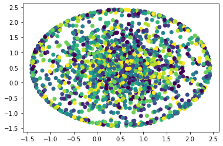
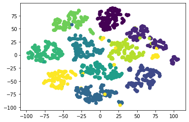

# t-SNE

My realization of [t-SNE visualization algorithm](https://lvdmaaten.github.io/tsne/). Example of usage is available at `tsne.ipynb` ([open in Google Colab](https://colab.research.google.com/github/Binpord/mipt_visualisation/blob/main/hw4_tsne/tsne.ipynb))

Right now it happens to have a bug, I cannot find, that is why it does not seem to do anything meaningful. However KL-divergence between input points distribution and the output points distribution decreases steadily during the gradient descent process. Current result of my algorithm on the MNIST is as follows:

However, [scikit-learn version of t-SNE algorithm](https://scikit-learn.org/stable/modules/generated/sklearn.manifold.TSNE.html) produces very different and much more useful picture:

Note that points in both plots have colors based on the classification target.

Both algorithms had same parameters, mainly, perplexity was set to `5.0`, because in higher perplexities my algorithm does not seem to do anything (KL-div decreases by a mere percents from a very high number and resulting points still seem to be distributed randomly).

I am planning on pursuing this bug further, however now I have no time for it. Still I hope that my code is well documented and can be useful as an explanation of the algorithm.